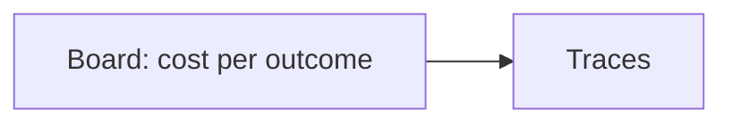

# Operate

TODO(part session): the rest of this page follows the steps.


```mermaid
flowchart LR
  B[Board: cost per outcome] --> T[Traces]
```

## Walkthrough

```bash
bun run verify part operate
```

Expect: `Part operate is done`.
